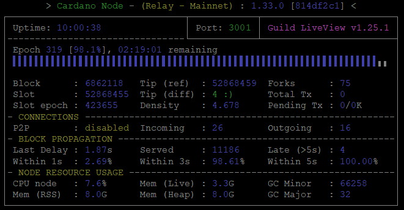

# **ノード起動**

## **スクリプト作成**

!!! tip "Tip"
    起動スクリプトには、{==ディレクトリ、ポート番号、DBパス、構成ファイルパス、トポロジーファイルパス==}など、{==カルダノノードを実行するために必要な変数が含まれています。==}


起動スクリプトファイルを作成し、起動スクリプトに実行権限を付与します。
``` bash title="startRelayNode1.sh"
cat > $NODE_HOME/startRelayNode1.sh << EOF 
#!/bin/bash
DIRECTORY=$NODE_HOME
PORT=6000
HOSTADDR=0.0.0.0
TOPOLOGY=\${DIRECTORY}/${NODE_CONFIG}-topology.json
DB_PATH=\${DIRECTORY}/db
SOCKET_PATH=\${DIRECTORY}/db/socket
CONFIG=\${DIRECTORY}/${NODE_CONFIG}-config.json
/usr/local/bin/cardano-node +RTS -N --disable-delayed-os-memory-return -I0.1 -Iw300 -A16m -F1.5 -H2500M -RTS run --topology \${TOPOLOGY} --database-path \${DB_PATH} --socket-path \${SOCKET_PATH} --host-addr \${HOSTADDR} --port \${PORT} --config \${CONFIG}
EOF
```

``` bash
cd $NODE_HOME
chmod +x startRelayNode1.sh
```

### **自動起動の設定(systemd)**

ユニットファイルの作成

``` bash title="cardano-node.service"
cat > $NODE_HOME/cardano-node.service << EOF 
# The Cardano node service (part of systemd)
# file: /etc/systemd/system/cardano-node.service 

[Unit]
Description     = Cardano node service
Wants           = network-online.target
After           = network-online.target 

[Service]
User            = ${USER}
Type            = simple
WorkingDirectory= ${NODE_HOME}
ExecStart       = /bin/bash -c '${NODE_HOME}/startRelayNode1.sh'
KillSignal=SIGINT
RestartKillSignal=SIGINT
TimeoutStopSec=300
LimitNOFILE=32768
Restart=always
RestartSec=5
SyslogIdentifier=cardano-node

[Install]
WantedBy	= multi-user.target
EOF
```

システムフォルダにユニットファイルをコピーして、権限を付与します。
``` bash
sudo cp $NODE_HOME/cardano-node.service /etc/systemd/system/cardano-node.service
```
``` bash
sudo chmod 644 /etc/systemd/system/cardano-node.service
```

次のコマンドを実行して、OS起動時にサービスの自動起動を有効にします。
``` bash
sudo systemctl daemon-reload
sudo systemctl enable cardano-node
```

!!! info "エイリアスの設定"
    任意の単語で起動出来るように設定します。
    ``` bash
    echo alias cnode='"journalctl -u cardano-node -f"' >> $HOME/.bashrc
    echo alias cnstart='"sudo systemctl start cardano-node"' >> $HOME/.bashrc
    echo alias cnrestart='"sudo systemctl reload-or-restart cardano-node"' >> $HOME/.bashrc
    echo alias cnstop='"sudo systemctl stop cardano-node"' >> $HOME/.bashrc
    source $HOME/.bashrc
    ```

    !!! tip "エイリアス"
        === "ログ表示"
            ``` bash
            cnode
            ```
            
        === "ノード起動"
            ``` bash
            cnstart
            ```
            
        === "ノード再起動"
            ``` bash
            cnrestart
            ```
            
        === "ノード停止"
            ``` bash
            cnstop
            ```


## **gLiveViewのインストール**
 
!!! info "gLiveViewについて"
    gLiveViewは、ノードステータスを可視化するTUIツールです。  
    このツールはカルダノコミュニティ [Guild Operators](https://cardano-community.github.io/guild-operators/#/Scripts/gliveview) の功績によるものです。


Guild LiveViewをインストールします。

``` bash
mkdir $NODE_HOME/scripts
cd $NODE_HOME/scripts
sudo apt install bc tcptraceroute -y
```

``` bash
curl -s -o gLiveView.sh https://raw.githubusercontent.com/cardano-community/guild-operators/master/scripts/cnode-helper-scripts/gLiveView.sh
curl -s -o env https://raw.githubusercontent.com/cardano-community/guild-operators/master/scripts/cnode-helper-scripts/env
chmod 755 gLiveView.sh
```

``` bash
sed -i $NODE_HOME/scripts/env \
    -e '1,73s!#CNODE_HOME="/opt/cardano/cnode"!CNODE_HOME=${NODE_HOME}!' \
    -e '1,73s!#UPDATE_CHECK="Y"!UPDATE_CHECK="N"!' \
    -e '1,73s!#CONFIG="${CNODE_HOME}/files/config.json"!CONFIG="${CNODE_HOME}/'${NODE_CONFIG}'-config.json"!' \
    -e '1,73s!#SOCKET="${CNODE_HOME}/sockets/node.socket"!SOCKET="${CNODE_HOME}/db/socket"!'
```

## **ノードを起動**

カルダノノードを起動します。
``` bash
sudo systemctl start cardano-node
```

起動後のノードログを確認
!!! tip "ログ確認"
    === "エイリアス"
        ``` bash
        cnode
        ```
        
    === "or"
    
    === "コマンド"
        ``` bash
        journalctl --unit=cardano-node --follow
        ```


チェーンが同期するまでお待ちください。
> 数秒〜数分かかります。
!!! tip "チェーン同期確認について"
    * {==**Started opening Ledger DB**と表示されていたら**同期準備中**です。==}
    > ++ctrl+c++ で閉じてもノードは停止しません。
    
    !!! tip "チェーン同期確認"
        ``` bash
        cardano-cli query tip $NODE_NETWORK | grep syncProgress
        ```
        > 戻り値が**"syncProgress": "100.00"**であれば同期完了


エイリアス設定

``` bash
echo alias glive="'cd $NODE_HOME/scripts; ./gLiveView.sh'" >> $HOME/.bashrc
source $HOME/.bashrc
```
    
gLiveviewを起動します。

``` bash
glive
```


