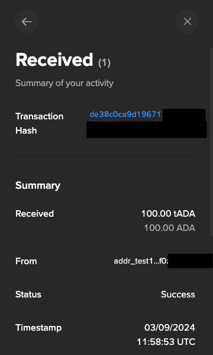

# **トランザクション送受信**

## **`ノード側ウォレットアドレス`から`Lace側ウォレットアドレス`へ送信**
ノード側(payment.addr)のウォレットアドレスからLaceのウォレットアドレスへ送信する例です。

!!! info
    **1 tADA** = **1,000,000 lovelace** で覚えます。  

!!! example
    lovelace形式で送信する金額を設定します。
    > 例）100 tADA      
    ```
    amountToSend=100000000
    ```  

!!! tip "Tip"
    送信先のアドレスは`Lace Wallet`の`Receive`をクリックしてコピーしてください。  


- ### **送信先設定**
最新のスロットを取得し、送金先のアドレスを設定します。
``` bash
cd $NODE_HOME
currentSlot=$(cardano-cli query tip $NODE_NETWORK | jq -r '.slot')
echo Current Slot: $currentSlot
```
``` bash
amountToSend=<送信金額>
echo amountToSend: $amountToSend
```
``` bash
destinationAddress=<送金先アドレス>
echo destinationAddress: $destinationAddress
```

- ### **算出〜トランザクション構築**
payment.addrの残高算出
``` bash
cardano-cli query utxo \
    --address $(cat payment.addr) \
    $NODE_NETWORK > fullUtxo.out

tail -n +3 fullUtxo.out | sort -k3 -nr | sed -e '/lovelace + [0-9]/d' > balance.out

cat balance.out
```
UTXO算出
``` bash
tx_in=""
total_balance=0
while read -r utxo; do
    in_addr=$(awk '{ print $1 }' <<< "${utxo}")
    idx=$(awk '{ print $2 }' <<< "${utxo}")
    utxo_balance=$(awk '{ print $3 }' <<< "${utxo}")
    total_balance=$((${total_balance}+${utxo_balance}))
    echo TxHash: ${in_addr}#${idx}
    echo ADA: ${utxo_balance}
    tx_in="${tx_in} --tx-in ${in_addr}#${idx}"
done < balance.out
txcnt=$(cat balance.out | wc -l)
echo Total ADA balance: ${total_balance}
echo Number of UTXOs: ${txcnt}
```
コマンド実行
``` bash
cardano-cli transaction build-raw \
    ${tx_in} \
    --tx-out $(cat payment.addr)+0 \
    --tx-out ${destinationAddress}+0 \
    --invalid-hereafter $(( ${currentSlot} + 10000)) \
    --fee 0 \
    --out-file tx.tmp
```
最低手数料の出力
``` bash
fee=$(cardano-cli transaction calculate-min-fee \
    --tx-body-file tx.tmp \
    --tx-in-count ${txcnt} \
    --tx-out-count 2 \
    $NODE_NETWORK \
    --witness-count 1 \
    --byron-witness-count 0 \
    --protocol-params-file params.json | awk '{ print $1 }')
echo fee: $fee
```
計算結果の出力
``` bash
txOut=$((${total_balance}-${fee}-${amountToSend}))
echo Change Output: ${txOut}
```
合計出力金額の最終トランザクションの構築
``` bash
cardano-cli transaction build-raw \
    ${tx_in} \
    --tx-out $(cat payment.addr)+${txOut} \
    --tx-out ${destinationAddress}+${amountToSend} \
    --invalid-hereafter $(( ${currentSlot} + 10000)) \
    --fee ${fee} \
    --out-file tx.raw
```

- ### **署名〜送信**
トランザクションに署名
``` bash
cd $NODE_HOME
cardano-cli transaction sign \
    --tx-body-file tx.raw \
    --signing-key-file payment.skey \
    $NODE_NETWORK \
    --out-file tx.signed
```
署名されたトランザクションをブロックチェーンに送信
``` bash
cardano-cli transaction submit \
    --tx-file tx.signed \
    $NODE_NETWORK
```
> Transacsion Successfully submittedと表示されれば成功


!!! tip "入金確認"
    指定した金額と一致していることを確認
    ``` bash
    cardano-cli query utxo \
        --address ${destinationAddress} \
        $NODE_NETWORK
    ```
    ``` { .yaml .no-copy }
                            TxHash                                 TxIx        Amount
    --------------------------------------------------------------------------------------
    de38c0ca9d19671*************************************************     1        100000000 lovelace + TxOutDatumNone
    ```
    
    

## **`Lace側ウォレットアドレス`から`ノード側ウォレットアドレス`へ送信**

- ### **送信先設定**
payment.addrの受信アドレスをコピーします。
``` bash
echo "$(cat $NODE_HOME/payment.addr)"
```
Laceの**`[Send]`**をクリックし、アドレス貼り付け欄に貼り付け、送信したい金額を入力し、`[Review transaction]`をクリックします。  

> ここでは全額の`MAX`をクリックしました。

- ### **トランザクション概要**
トランザクションサマリーが表示されますので、送信先が正しいことを確認して`[Confirm]`をクリックします。  


- ### **トランザクション確認**
パスワードを入力して`[Confirm]`をクリックします。  


- ### **送信完了**
  

!!! tip "受信確認"
    受信確認として`Payment.addr`の残高を確認
    ``` bash
    cardano-cli query utxo \
        --address $(cat payment.addr) \
        $NODE_NETWORK
    ```
    ``` { .yaml .no-copy }
                            TxHash                                 TxIx        Amount
    --------------------------------------------------------------------------------------
    3763fdfe45ac1e5*************************************************     0        97860000 lovelace + TxOutDatumNone
    de38c0ca9d19671*************************************************     0        9899826271 lovelace + TxOutDatumNone
    ```
